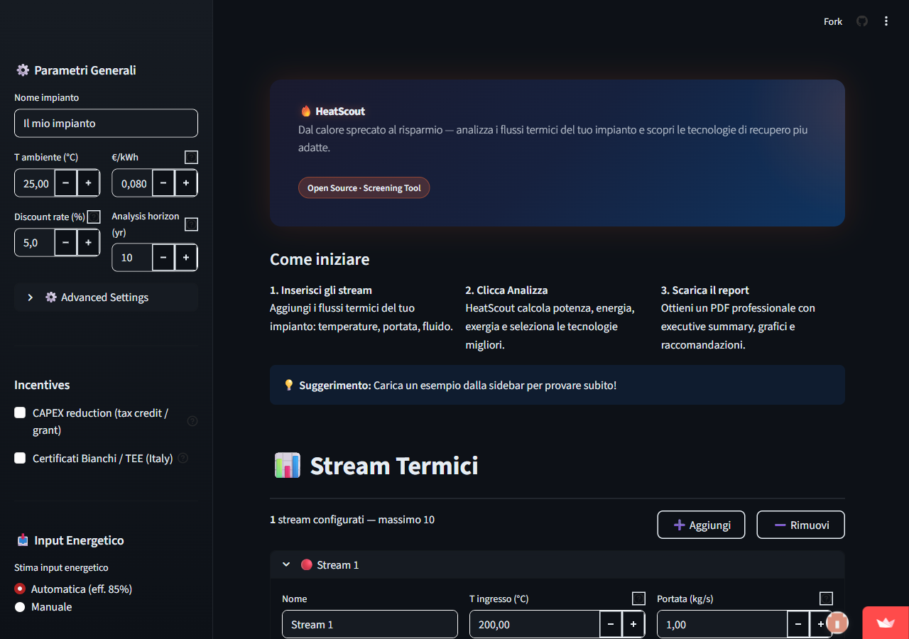

# HeatScout

**Free screening tool for industrial waste heat recovery.**

Enter your plant's waste heat streams → get in 5 minutes the applicable technologies, estimated costs, and investment payback.



[**Try the live demo →**](https://heatscout.streamlit.app)

[](https://github.com/cesabici-bit/heatscout/actions/workflows/ci.yml)
[](LICENSE)
[](https://www.python.org/downloads/)

---

## What it does

| Step | Description |
|------|-------------|
| **1. Input** | Define thermal streams: fluid, temperatures, flow rate, operating hours |
| **2. Analysis** | Calculates thermal power (kW), annual energy (MWh), exergy, waste cost |
| **3. Balance** | Interactive Sankey diagram of the energy balance |
| **4. Technologies** | Recommends from 8 recovery technologies (HX, heat pumps, ORC, ...) |
| **5. Economics** | Estimates CAPEX (±30%), payback, NPV, IRR for each technology |
| **6. Sensitivity** | Energy price sweep (±50%) and tornado chart on 4 key parameters |
| **7. Report** | Professional PDF report + Excel export + JSON save/load |

## Features

- **8 recovery technologies**: gas-gas HX, economizer, liquid HX, HRSG, air/water heat pumps, ORC, combustion air preheater
- **10 preloaded industrial examples**: foundry, dairy, ceramics, glass, paper, brewery, chemical, textile, data center, multi-stream complex
- **Incentive analysis**: generic CAPEX reduction (tax credits, grants — any country) + Italian White Certificates (TEE)
- **Sensitivity analysis**: energy price sweep with payback/NPV charts + tornado chart (±20% on price, CAPEX, hours, efficiency)
- **All parameters editable**: energy price, discount rate, analysis horizon, OPEX/installation multipliers
- **Import/Export**: CSV/Excel stream import, Excel export (3 sheets), JSON save/load, PDF report
- **Methodology section**: all formulas, correlations, and sources cited in-app
- **249 automated tests** across 5 levels (unit, physics sanity, property-based, snapshot, real validation)

## Who needs it

- **Energy managers** evaluating heat recovery in their plant
- **ESCos and energy consultants** doing industrial energy audits
- **Engineering students and researchers** in energy/thermal engineering
- Anyone with waste heat asking: *"is it worth recovering?"*

## Quick Start

```bash
# Install
pip install -e ".[dev]"

# Run
streamlit run heatscout/web/app.py
```

Opens at `http://localhost:8501`. Load a preloaded example from the sidebar to get started.

## Tests

```bash
pytest tests/ -v
```

249 tests on 5 levels:

1. **Unit tests** — functional validation of every module
2. **Physics sanity** — cp vs tabulated values (ASHRAE, Perry's), thermodynamics laws
3. **Property-based** (Hypothesis) — invariants verified on random inputs
4. **Snapshot golden** — anti-regression on 10 examples (83 recommendations)
5. **Real validation** — comparison with measured data from real plants (DOE, ETEKINA H2020)

## Stack

| Component | Technology |
|-----------|-----------|
| Fluid properties | [CoolProp](http://www.coolprop.org/) + custom correlations |
| Charts | [Plotly](https://plotly.com/) (Sankey, bar charts, sensitivity) |
| UI | [Streamlit](https://streamlit.io/) |
| PDF | [ReportLab](https://www.reportlab.com/) |
| Economics | [numpy-financial](https://numpy.org/numpy-financial/) (NPV, IRR) |
| Linting | [Ruff](https://docs.astral.sh/ruff/) (pre-commit hooks) |

## Assumptions and Limitations

- CAPEX correlations have **±30%** uncertainty (sources: Thekdi/ACEEE, IEA, Quoilin et al.)
- Estimated savings have **±15%** uncertainty
- Efficiency models are first-order (simplified correlations)
- This tool is for **initial screening** — it does not replace a detailed engineering feasibility study
- All sources and formulas are documented in the in-app Methodology section

## Acknowledgments

Development assisted by [Claude Code](https://claude.ai/claude-code) (Anthropic).

## Contributing

See [CONTRIBUTING.md](CONTRIBUTING.md) for guidelines.

## License

[MIT](LICENSE)
